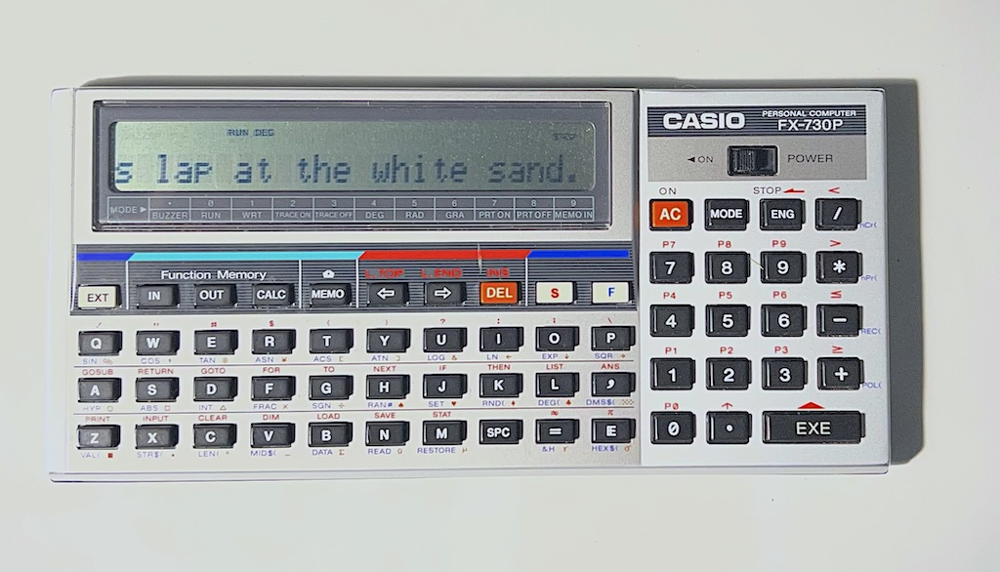

# Casio Pocket Computer Python BASIC Interpreter



Python BASIC interpreter that is compatible with the retro 80s Casio FX-730P pocket computer (and probably others - not tested yet).

You can use this to develop CASIO BASIC programs locally, before running them on an actual device.

Apologies; the original python scripts were largely generated by LLMs, but reviewed and tested by a human. 

It's not following best practices for a BASIC interpreter, and I wouldn't consider it a model project. Nonetheless, I've found it very useful for playing with retro pocket computers, so I thought I'd share it.

## Important to know

The BASIC file must begin with a filename (upper and lower case allowed). This is shown on the calculator display as the program is uploading via the tape interface.

## Usage on Desktop

Run main interpreter with a BASIC file:
```
python3 casio_basic <filename.bas>
```

There is also a conversion utility which lets you use labels instead of line numbers. 
I find it much easier to code in that than the original CASIO basic. This script will convert it to proper Casio BASIC before running, and also strip out comments for faster uploading to the actual device.
You can add the converter as a preprocessing step before the interpreter in your workflow.

```
./convert.py [-v|--verbose] [-c|--comments] filename_input.bas filename_output.bas
```

Example input:
```
My test
GOTO FOO
RANDOM_VALS:
REM IN: A=count B=seed; OUT: S(0)=count S(1..A)=values, Lisp order
S(0)=A
D=B
FOR C=1 TO A
F=1531*D+919
R=F-65536*INT(F/65536)
D=R
S(A-C+1)=R
NEXT C
RETURN
FOO:
GOSUB RANDOM_VALS
```

Gives output:
```
My test
140 GOTO 250
150 REM RANDOM_VALS
160 S(0)=A
170 D=B
180 FOR C=1 TO A
190 F=1531*D+919
200 R=F-65536*INT(F/65536)
210 D=R
220 S(A-C+1)=R
230 NEXT C
240 RETURN
250 REM FOO
260 GOSUB 150
```

## Getting your program onto a pocket computer

### Save / load

Use these excellent tools to convert your BASIC script to a WAV file and upload to the pockecom: https://www.mvcsys.de/doc/casioutil.html

To encode to wav:
`bas730 -w infile.bas outfile.wav`

Connect the FA-3 tape interface to your pockecom and the black cable to the speaker of your PC.

Now to upload:
- To clear out all the program memory, type `NEW ALL` in WRT mode. **Be careful - it wipes all data!**
- Put the pockecom in `RUN` mode.
- type `LOAD` to load in the current program area.
- Load the WAV in an audio player on the PC and play. Shortly, you should see the filename appear on the pockecom screen if all is going well.
- type `RUN` to start your program.


## Disclaimers

CASIO® is a registered trademark of Casio Computer Co., Ltd. This project is not affiliated with, sponsored by, or endorsed by Casio Computer Co., Ltd.

I've tested it on real hardware with quite complex programs, but I can't guarantee it's a 100% accurate simulation.

Use at your own risk. I make no guarantees of suitability or accuracy.
